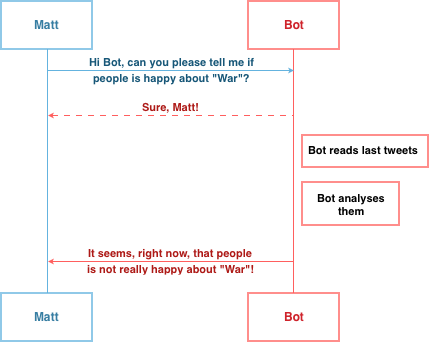

# Telepathy
Hi, I am an undergraduate computer engineering student and this is a personal project to introduce myself to python programming.

This project is not intended to be lucrative nor perfect, if you like my work and you do have a Telegram account you can contact *@ruaronicola*. If you don't have one .. What are you waiting for? :)

#### What is Telepathy?
Telepathy is a simple Web Application with a related Telegram Bot(https://github.com/ruaronicola/TelepathyBot), built using Flask framework. Its aim is just to analyse tweets regarding a user specified topic in order to estimate the community mood in real-time.

#### Configuration
```bash
cd /path/to/base/folder
pip install -r requirements.txt
cd contents
cp default.config config.py
pico config.py
# setup your configuration file
python
>>> import nltk
>>> nltk.download()
# download and install 'stopwords' corpus
>>> exit()
python main.py
```

#### How does it work?
The base-idea is really simple:

<a href="url"></a>
